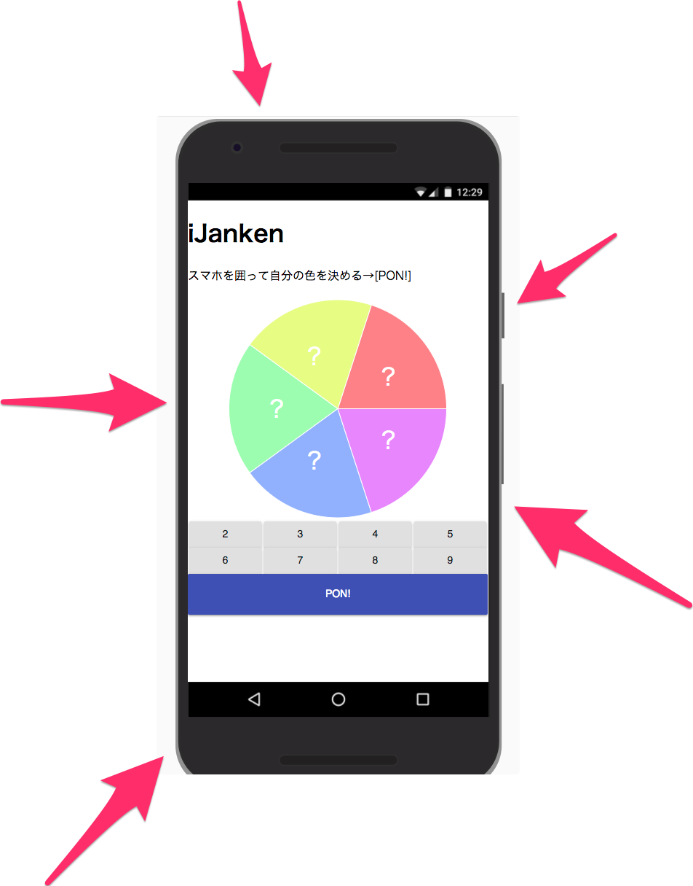

8人くらいでグダグダじゃんけんしてるのを見て、作りました。

### [作ったもの](https://elzup.github.io/i-janken/)

使用例: 5人で順番を決める時

#### 1\. アプリを出します

#### 2\. みんなでアプリを囲います

#### 3\. PON！

ジャンケンなしに一瞬で順番が決まりました！

アプリ: [https://elzup.github.io/i-janken/](https://elzup.github.io/i-janken/)

グラフは [Recharts](http://recharts.org/#/en-US/) ボタンは [Material-UI](https://material-ui-next.com/) を使ってます。

PWA 対応しています。

GitHub: [https://github.com/elzup/i-janken](https://github.com/elzup/i-janken)
