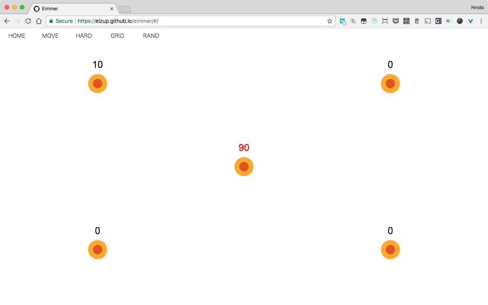
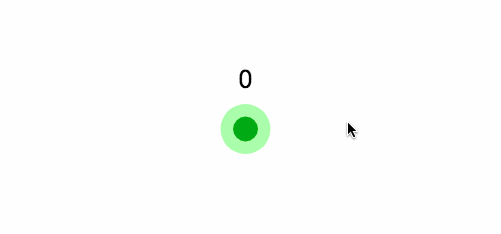
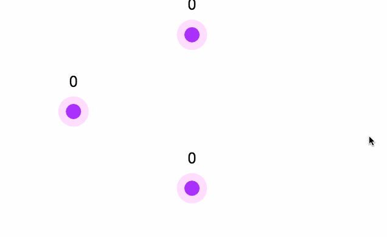
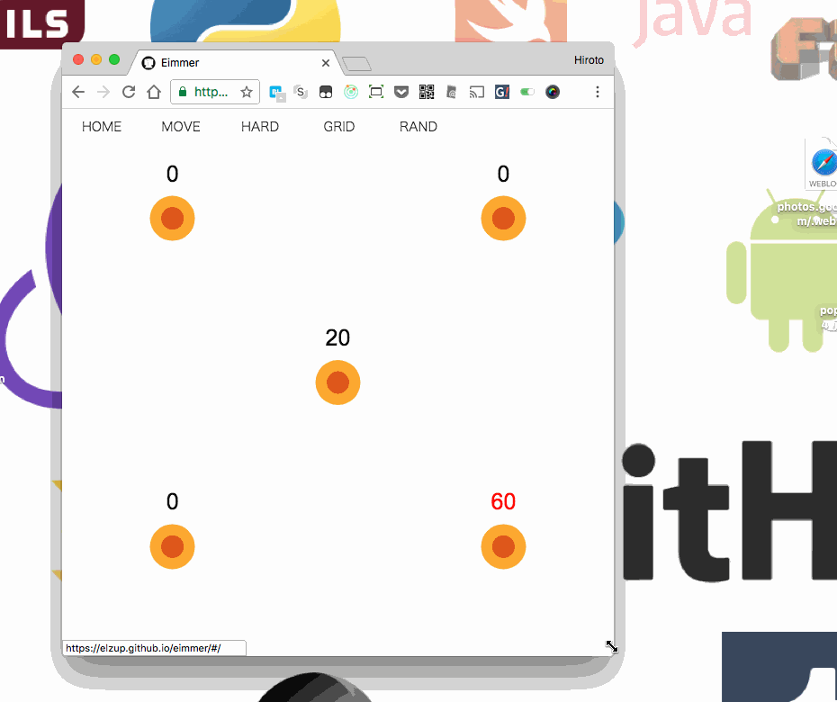

あなたは今目をつぶって(🍮)←ここにマウスカーソルを合わせることができますか？

GUIは避けられない時代、細かいマウス操作をミスってイライラすることも多いです。僕はよくポインタをうまく合わせられなくてドロップダウンメニューやリンクの周りを行ったり来たりします。

マウス操作に無駄な意識使ってしまってる気がしたので、気軽に使える練習場を作りました。

### 作ったもの

[https://elzup.github.io/eimmer/](https://elzup.github.io/eimmer/#/move)

スプラトゥーンの試し撃ち場のイメージで作りました。

ゲームやルールは用意していないので自由に使ってください。

もし的の間隔が調整したければWindowのサイズを変えて下さい。

主に使っているライブラリは以下です

-   react-konva: canvas・図形描画
-   react-move: アニメーション

ソースコード: [https://github.com/elzup/eimmer](https://github.com/elzup/eimmer)

ちなみにこの記事を書いてる今の今までエイムの綴りを間違えてました。正しくは aim です。eim じゃなくて aim でぐぐったら Web アプリたくさん出てきました😭。

### 他のアプリ

[Osu!](https://osu.ppy.sh/):マウスシューティング音ゲー(Windows)

[Aim Hero](http://store.steampowered.com/app/518030/Aim_Hero/?l=japanese): エイム練習で有名なゲーム(Windows)

[CURSOR INVISIBLE](http://dagobah.net/flash/Cursor_Invisible.swf): マウスカーソルが見えなくなるゲームシューティング

[3D Aim Trainer](https://www.3daimtrainer.com/game.php): ゲームモードが多く、感度や画面解像度踏まえて調節できて本格的
